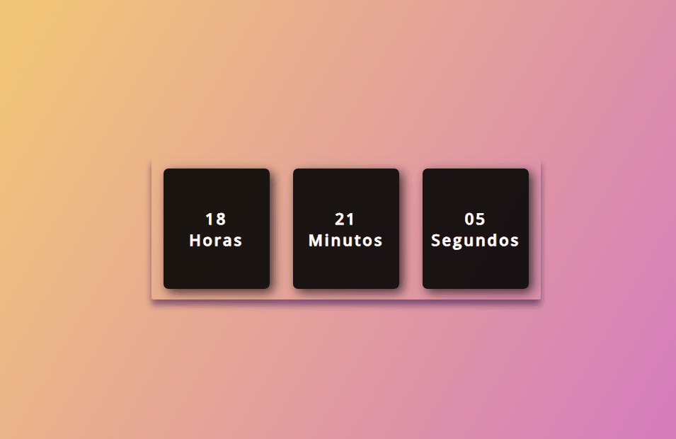

# Relógio Digital
 *Relógio Digital DINÂMICO*
 
*  <a>__*HTML*__</a>
*  <a>__*CSS*__</a>
*  <a>__*JavaScript*__</a>

***

  

***
## Agradecimentos :clap:

* Primeiramente a Deus.
* Se você achar que esse projeto agregou algo para você, por favor deixe uma estrela.
* Meus sinceros agradecimentos a todos que visitam o projeto e deixa uma estrela como reconhecimento.
* Foi muito gratificante desenvolver esse Relogio Digital.

***
